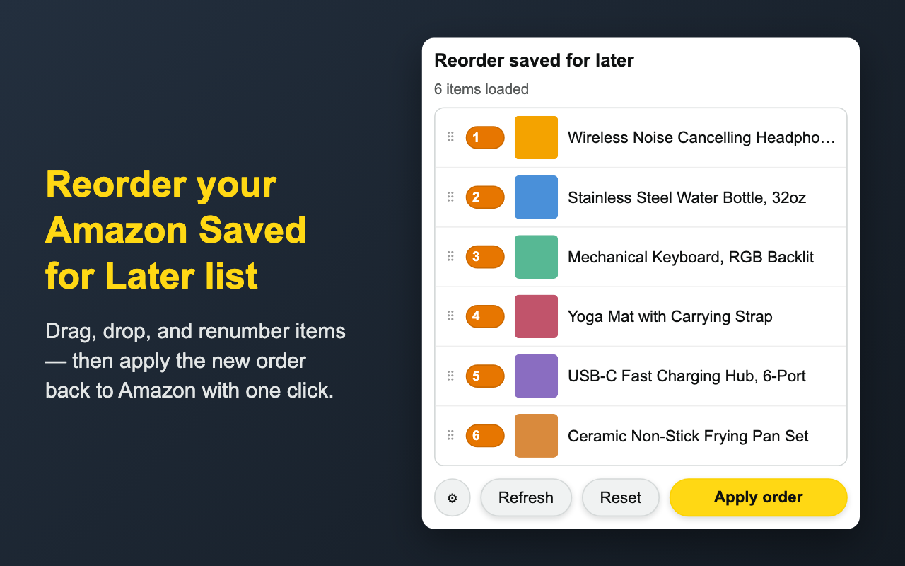
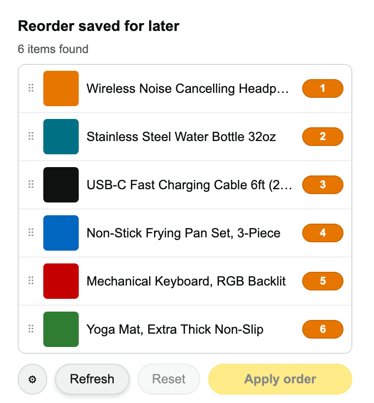
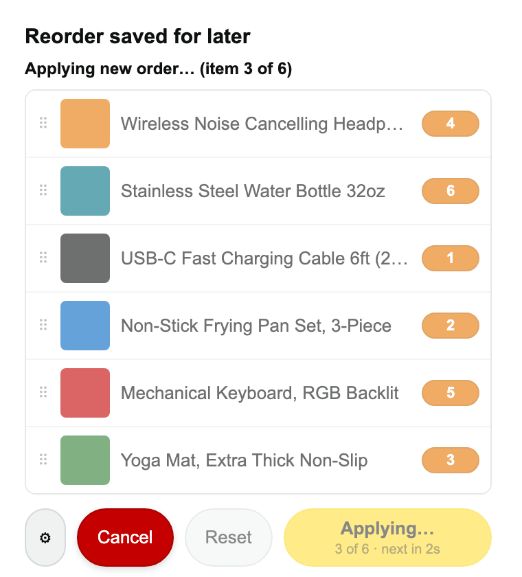

# Reorder Saved for Later - Amazon

A Chrome extension that lets you drag-and-drop (or type a position number)
to reorder the items in your Amazon "Saved for later" list, then applies
that order for real on amazon.com.

No data is collected, stored remotely, or transmitted anywhere. Everything
happens locally in your browser.

| Idle | Reordering in progress |
| --- | --- |
|  |  |

## Why

Amazon has no way to reorder saved-for-later items — new saves always land
at one end of the list, and there's no drag handle or API for rearranging
them. This extension works around that by driving Amazon's own "Move to
cart" / "Save for later" controls to bump items into the position you want.

## Install

1. Clone or download this repository.
2. Open `chrome://extensions` in Chrome.
3. Enable "Developer mode" (top right).
4. Click "Load unpacked" and select this project's folder.
5. Pin the extension for easy access.

## Usage

1. Go to your Amazon cart page and scroll down to "Saved for later".
2. Click the extension icon.
3. Drag items to reorder them, or type a number into an item's position
   badge to jump it to that spot — everything below it shifts down
   automatically.
4. Click **Load all items** if you have more saved items than Amazon has
   currently loaded on the page (shown by the "may be incomplete" banner).
5. Click **Apply order** to have the extension actually rearrange the items
   on Amazon by bumping them through Move to cart / Save for later.
6. If you close the popup before applying, your in-progress arrangement is
   preserved as long as you don't reload or navigate away from the page —
   reopening the popup restores it. Reloading/navigating/closing the tab
   resets it back to the page's real order, and the **Reset** button lets
   you do that manually too.

## Settings

Click the ⚙ button to adjust:
- **Delay between actions** — how long to wait between each bump step.
  Increase this if Amazon's page feels slow to respond and items get
  missed or duplicated.
- **Refresh the page after applying the order** — reloads the page once
  reordering finishes, so you see the final result immediately.

## Limitations

- **Unavailable items are skipped.** Items marked "Currently unavailable"
  or "This item is no longer available from the seller you selected"
  don't have a working "Move to cart" control, which is what the
  extension relies on to detect and move saved items. These items won't
  show up in the extension's list at all, can't be reordered, and will
  stay wherever they currently sit in your real saved-for-later list.
- Reordering works by actually moving items to your cart and back, so it
  takes a few seconds per item — the more items you reorder, the longer
  Apply takes.
- Amazon's page markup isn't versioned or guaranteed stable; if Amazon
  changes their cart page layout, item detection may need updating.

## Support

If this saved you some tedious clicking, you can
[buy me a coffee](https://www.buymeacoffee.com/maxwellluong).

## Project

[github.com/maxandcheeses/chrome-reorder-saved-for-later-amazon](https://github.com/maxandcheeses/chrome-reorder-saved-for-later-amazon)
